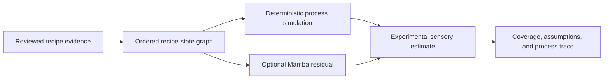

# Flavor Bench / YumYumAI

**A research workbench for studying how preparation and cooking order change a recipe's intermediate state and experimental sensory estimate.**

This repository presents the research direction and current prototype. The implementation, source datasets, and model artifacts are maintained separately.

## Recorded demo

[Watch the Flavor Bench research workbench demo](media/FlavorBenchShowcase1.mp4). The recording shows the local prototype; it is a product demonstration, not a sensory-validation result.

## Research question

An ingredient list does not record when an ingredient was added, how it was prepared, or which heat and rest steps it experienced. Flavor Bench tests whether an explicit, reviewable cooking sequence can support more useful sensory estimates than an ingredient-only baseline.

## Current prototype

- Review a local photo or video, annotate cooking events, and confirm quantities and preparation.
- Compile reviewed events into an ordered recipe-state graph and inspect intermediate states.
- Compare two curated recipes with the same ingredients but a different order of addition.
- Inspect an eleven-dimension fingerprint. Five taste dimensions have prototype ingredient-model estimates where source data exists; curated cases fill unsupported dimensions with clearly labeled illustrative proxies. Users can enter their own 0–100 observations separately.
- Compare a deterministic process baseline with an optional Mamba selective state-space residual. The bundled checkpoint uses synthetic training examples.

## Scientific status

**This is a testable research prototype, not a validated taste predictor.** The process-to-sensory adjustment is heuristic; ingredient profiles and concentration-response curves are sparse; no controlled sensory study has yet established prediction accuracy. The Mamba model is integrated as an experimental sequence component but has not been trained on measured cooking outcomes or shown to outperform simpler temporal baselines.

The next meaningful milestone is a narrow, controlled evaluation: collect permitted recipe/process data and independent sensory observations, define held-out recipe families, and compare ingredient-only, deterministic process, and learned sequence baselines.

## Access

The full code and data repository is private while source-data redistribution rights and research claims are reviewed. This showcase contains research documentation and the recorded demo only. Contact the project owner for a walkthrough or research collaboration.
